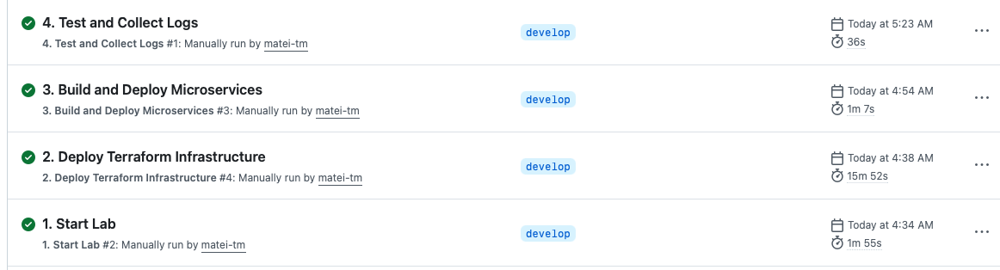

# Cloud Native Architecture Course - Introspect 2B: GenAI-enabled Claim Status API

[](https://github.com/matei-tm/introspect2B/actions/workflows/start-lab.yml)
[](https://github.com/matei-tm/introspect2B/actions/workflows/terraform-deploy.yml)
[](https://github.com/matei-tm/introspect2B/actions/workflows/deploy-services.yml)
[](https://github.com/matei-tm/introspect2B/actions/workflows/test-and-logs.yml)

- [Cloud Native Architecture Course - Introspect 2B: GenAI-enabled Claim Status API](#cloud-native-architecture-course---introspect-2b-genai-enabled-claim-status-api)
  - [⚡ TL;DR - Quick Start](#-tldr---quick-start)
  - [📚 Wiki](#-wiki)
  - [📝 License](#-license)
  - [🤝 Contributing](#-contributing)

GenAI-enabled Claim Status API on AWS using Amazon EKS (on EC2) and Amazon API Gateway.


This project is part of the [CTS - Architecting for Performance CNA Level 2 – Intermediate (GGM)](https://www.niit.com/) course.

## ⚡ TL;DR - Quick Start

**Get up and running in minutes using GitHub Actions automation!**

1. **Fork this repository** to your GitHub account

2. **Configure GitHub Secrets** (Settings → Secrets and variables → Actions → New repository secret):
   ```
   AWS_ACCESS_KEY_ID       = <your-aws-access-key>
   AWS_SECRET_ACCESS_KEY   = <your-aws-secret-key>
   ECR_REGISTRY            = <mandatory: your-account-id.dkr.ecr.region.amazonaws.com>
   SITE_USER               = <your-lab-username>
   SITE_PASSWORD           = <your-lab-password>
   ```

3. **Run the workflows** (Actions tab):
   **Available GitHub Actions workflows:**

   

   - **Step**: `1. Start Lab` - Initialize lab environment with Playwright automation (~2 min)
   - **Step**: `2. Deploy Terraform Infrastructure` - Provisions EKS, VPC, ECR, SNS/SQS, DynamoDB (~15 min)
   - **Step**: `3. Build and Deploy Microservices` - Builds and deploys services (~5 min)
   - **Step**: `4. Test and Collect Logs` - Comprehensive testing and log collection (~2 min)
   - **Verify**: Downloads logs as artifact (30-day retention) with detailed test results and service logs

That's it! Your microservices are now running on EKS with Dapr pub/sub messaging. 🚀

   

## 📚 Wiki

For detailed setup, local development, and troubleshooting, continue reading the [wiki](https://github.com/matei-tm/introspect2B/wiki).

   

## 📝 License

This project is licensed under the MIT License - see the [LICENSE](LICENSE) file for details.

This project is for educational purposes as part of the [CTS - Architecting for Performance CNA Level 2 – Intermediate (GGM)](https://www.niit.com/) course.

## 🤝 Contributing

Feel free to submit issues or pull requests for improvements!