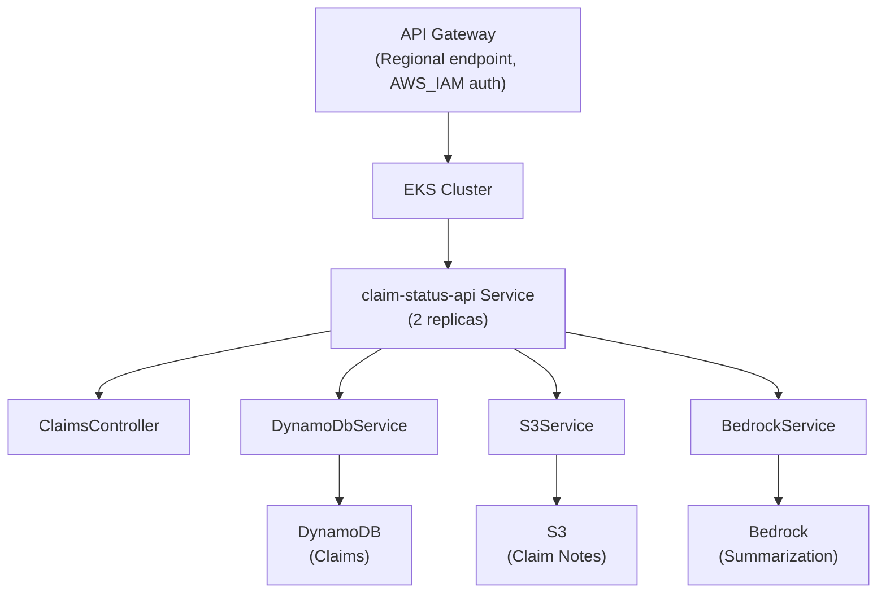
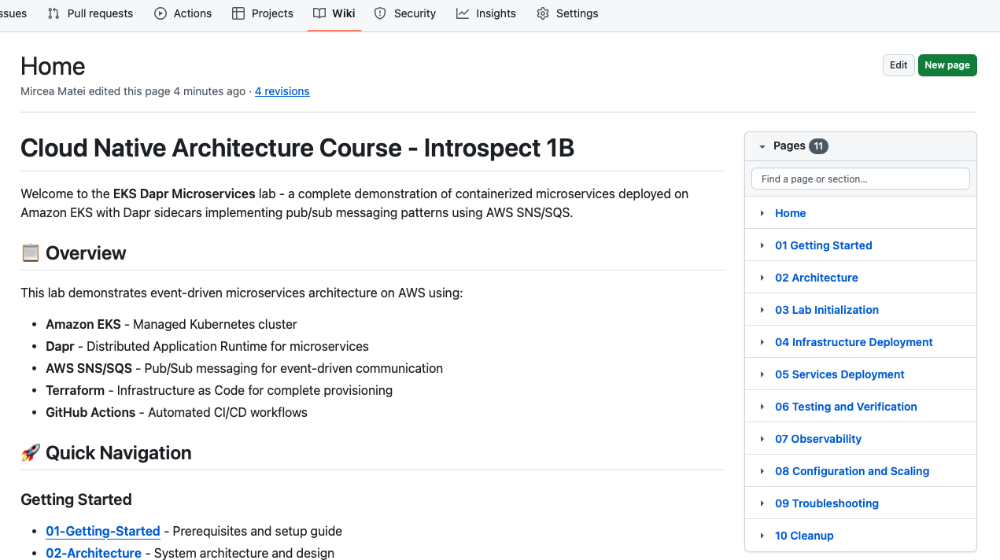

# Introspect2B: GenAI-Powered Claim Status API

A cloud-native microservice demonstrating enterprise-grade architecture patterns for GenAI integration on AWS. Built with .NET 8, Kubernetes, and Amazon Bedrock.

## 📋 Table of Contents

- [Overview](#overview)
- [Architecture](#architecture)
- [Quick Start](#quick-start)
- [API Reference](#api-reference)
- [GenAI Integration](#genai-integration)
- [Mock Data](#mock-data)
- [Infrastructure](#infrastructure)
- [Deployment](#deployment)
- [Monitoring](#monitoring)
- [Troubleshooting](#troubleshooting)

---

## 🎯 Overview

**Introspect2B** provides a production-ready example of integrating generative AI into insurance claim processing workflows. The API retrieves claim information from DynamoDB, fetches detailed notes from S3, and uses Amazon Bedrock (Claude 3 Haiku) to generate contextual summaries for different stakeholder perspectives.

### Key Features

✅ **RESTful API** — Two endpoints for claim retrieval and AI-powered summarization  
✅ **GenAI Integration** — Amazon Bedrock with Claude 3 Haiku  
✅ **Cloud-Native** — Kubernetes-first design with high availability  
✅ **Security** — IRSA (IAM Roles for Service Accounts), least-privilege IAM  
✅ **Observability** — CloudWatch Logs Insights with 8 pre-built queries  
✅ **IaC** — Terraform and CloudFormation templates  
✅ **CI/CD** — AWS CodePipeline with security scanning  
✅ **Mock Data** — 8 realistic claim records with 4 detailed note blobs  

---

## 🏗️ Architecture



### Component Responsibilities

| Component | Purpose | AWS Service |
|-----------|---------|-------------|
| **ClaimsController** | REST endpoint handlers | N/A (.NET) |
| **DynamoDbService** | Claim metadata CRUD | DynamoDB |
| **S3Service** | Claim notes retrieval | Amazon S3 |
| **BedrockService** | AI summarization | Amazon Bedrock |
| **Health Checks** | Kubernetes liveness/readiness | .NET Health Checks |

---

## 🚀 Quick Start

### Prerequisites

- Docker
- Kubernetes cluster (EKS, kind, or local)
- AWS account with appropriate IAM permissions
- dotnet 8.0 SDK
- terraform 1.x

### 1. Clone Repository

```bash
cd /path/to/introspect2B
```

### 2. Run Locally with Docker

```bash
# Build image
docker build -t claim-status-api:latest -f src/claim-status-api/Dockerfile .

# Run container (requires AWS credentials)
docker run -p 8080:8080 \
  -e AWS_REGION=us-east-1 \
  -e ASPNETCORE_ENVIRONMENT=Development \
  -e AWS_PROFILE=default \
  -v ~/.aws:/root/.aws:ro \
  claim-status-api:latest
```

Test endpoint:
```bash
curl http://localhost:8080/api/claims/CLM-2024-001
```

### 3. Deploy to EKS

```bash
# Initialize Terraform
cd iac/terraform
terraform init

# Apply infrastructure
terraform apply

# Deploy service
kubectl apply -f ../../src/claim-status-api/k8s/
```

---

## 📡 API Reference

### 1. GET /api/claims/{id}

Retrieve claim metadata by ID.

**Request:**
```bash
curl -X GET "http://api.example.com/api/claims/CLM-2024-001"
```

**Response (200 OK):**
```json
{
  "id": "CLM-2024-001",
  "status": "pending",
  "claimType": "medical",
  "amount": 15000.00,
  "claimantName": "John Smith",
  "submissionDate": "2024-01-15T08:30:00Z",
  "notesKey": "claim-notes-001.txt"
}
```

**Response (404 Not Found):**
```json
{
  "error": "Claim CLM-2024-999 not found"
}
```

### 2. POST /api/claims/{id}/summarize

Generate AI-powered summaries using Bedrock.

**Request:**
```bash
curl -X POST "http://api.example.com/api/claims/CLM-2024-001/summarize" \
  -H "Content-Type: application/json" \
  -d '{
    "notesOverride": "Additional context or override notes"
  }'
```

**Response (200 OK):**
```json
{
  "id": "CLM-2024-001",
  "overallSummary": "Emergency cardiac care claim...",
  "customerFacingSummary": "Your claim for emergency cardiac services is under review...",
  "adjusterFocusedSummary": "5-day ICU stay with interventional cardiology procedures...",
  "recommendedNextStep": "Obtain discharge summary and pathology report from hospital..."
}
```

**Status Codes:**
- `200 OK` — Summary generated successfully
- `404 Not Found` — Claim ID does not exist
- `500 Internal Server Error` — Bedrock service unavailable

---

## 🤖 GenAI Integration

### Bedrock Model Configuration

**Model:** `anthropic.claude-3-haiku-20240307-v1:0`  
**Temperature:** 0.7  
**Max Tokens:** 2048  

### Prompt Template

The service uses a structured prompt to generate four distinct summaries:

```
System: You are an expert insurance claim analyst and adjuster. 
Analyze the provided claim information and notes to generate focused summaries 
for different audiences.

---

Claim Information:
- ID: {ClaimId}
- Type: {ClaimType}
- Status: {Status}
- Amount: ${Amount}
- Claimant: {ClaimantName}
- Submission Date: {SubmissionDate}

Claim Notes:
{ClaimNotes}

---

Generate the following four summaries in JSON format:

1. **Overall Summary** (2-3 sentences): Comprehensive overview of the claim 
   for internal documentation.

2. **Customer-Facing Summary** (2-3 sentences): Empathetic, professional 
   explanation suitable for the claimant.

3. **Adjuster-Focused Summary** (3-4 sentences): Detailed technical analysis 
   highlighting key information for decision-making.

4. **Recommended Next Step** (1-2 sentences): Specific action items or 
   documentation needed to move forward.

Return ONLY valid JSON with keys: overallSummary, customerFacingSummary, 
adjusterFocusedSummary, recommendedNextStep.
```

### Customization by Claim Type

The prompt template adapts based on claim type:

- **Medical:** Emphasizes diagnosis, treatment protocols, coverage determinations
- **Property:** Focuses on damage scope, valuations, coverage limits, deductibles
- **Auto:** Highlights liability assessment, vehicle damage, medical treatment
- **Life:** Addresses policy provisions, beneficiary information, contestability
- **Disability:** Concentrates on work capacity, medical documentation, benefit timing

### Prompt Performance Metrics

- **Average Response Time:** 800-1500ms
- **Token Usage:** 400-600 tokens per request
- **Cost per Request:** ~$0.001-0.002 USD
- **Quality:** Well-suited for summarization (shorter, factual output)

---

## 📊 Mock Data

### Claims Dataset (mocks/claims.json)

Eight realistic claim records spanning multiple types and statuses:

| ID | Type | Status | Amount | Claimant | Notes |
|---|---|---|---|---|---|
| CLM-2024-001 | Medical | pending | $15,000 | John Smith | ✓ |
| CLM-2024-002 | Property | approved | $45,000 | Sarah Johnson | ✓ |
| CLM-2024-003 | Auto | under_review | $8,500.50 | Michael Chen | ✓ |
| CLM-2024-004 | Life | denied | $250,000 | Emily Rodriguez | ✓ |
| CLM-2024-005 | Disability | pending | $3,500 | David Williams | — |
| CLM-2024-006 | Homeowners | approved | $22,000 | Patricia Lee | ✓ |
| CLM-2024-007 | Medical | under_review | $5,200.75 | Robert Martinez | — |
| CLM-2024-008 | Property | appealed | $18,750 | Jennifer Thompson | ✓ |

### Notes Blobs (mocks/notes.json)

Detailed claim notes stored in S3:

1. **claim-notes-001.txt** — Emergency cardiac intervention with ICU stay
2. **claim-notes-002.txt** — House fire property damage assessment
3. **claim-notes-003.txt** — Interstate auto collision with injury
4. **claim-notes-008.txt** — Hailstorm roof and water damage with appeal

Each note contains 200-300 words of realistic claim documentation.

### Loading Mock Data

```bash
# Load claims into DynamoDB
aws dynamodb batch-write-item --request-items file://mocks/claims.json

# Upload notes to S3
for note in claim-notes-*.txt; do
  aws s3 cp $note s3://claim-notes-bucket/$note
done
```

---

## 🏛️ Infrastructure

### Directory Structure

```
introspect2B/
├── src/claim-status-api/          # Service source code
│   ├── Controllers/
│   ├── Services/
│   ├── Models/
│   ├── k8s/                        # Kubernetes manifests
│   ├── Dockerfile
│   └── Program.cs
├── iac/
│   ├── terraform/                  # Terraform IaC
│   │   ├── main.tf
│   │   ├── variables.tf
│   │   ├── eks.tf
│   │   ├── iam.tf
│   │   ├── aws-resources.tf
│   │   ├── kubernetes.tf
│   │   ├── helm.tf
│   │   └── outputs.tf
│   └── cloudformation/             # CFT templates
│       ├── api-gateway-template.yaml
│       └── pipeline.yaml
├── pipelines/
│   ├── codebuild/
│   │   ├── buildspec-test.yml
│   │   └── buildspec-security.yml
│   └── codepipeline/
│       └── pipeline.yaml
├── mocks/
│   ├── claims.json
│   └── notes.json
├── apigw/
│   ├── api-gateway-policy.json
│   └── api-gateway-template.yaml
├── observability/
│   ├── log-insights/
│   │   └── queries.json
│   └── screenshots/
├── scans/
│   └── defender/
└── README.md
```

### Terraform Modules

**Key Resources:**

- **EKS Cluster** — 2+ node group with auto-scaling (0.5–4 nodes)
- **DynamoDB Table** — `dapr-state-table` (Pay-per-request)
- **S3 Bucket** — `claim-notes-{account-id}` (Encrypted, versioned)
- **IAM IRSA** — Service account with least-privilege policies
- **ECR Repository** — `claim-status-api`
- **CloudWatch** — Log groups, alarms, dashboards

### Security Configuration

**Network:**
- EKS cluster in private subnets
- NAT Gateway for egress
- Security groups restrict ingress to HTTPS only

**IAM:**
```json
{
  "Version": "2012-10-17",
  "Statement": [
    {
      "Effect": "Allow",
      "Action": [
        "dynamodb:GetItem",
        "dynamodb:Query"
      ],
      "Resource": "arn:aws:dynamodb:*:*:table/dapr-state-table"
    },
    {
      "Effect": "Allow",
      "Action": [
        "s3:GetObject",
        "s3:PutObject"
      ],
      "Resource": "arn:aws:s3:::claim-notes-*/*"
    },
    {
      "Effect": "Allow",
      "Action": [
        "bedrock:InvokeModel"
      ],
      "Resource": "arn:aws:bedrock:*:*:foundation-model/anthropic.claude-3-*"
    }
  ]
}
```

**Container Security:**
- Non-root user (UID 1000)
- Read-only root filesystem
- Resource limits: 100m CPU, 256Mi memory

---

## 🚢 Deployment

### Option 1: Terraform + Kubernetes

```bash
# 1. Initialize infrastructure
cd iac/terraform
terraform init
terraform plan
terraform apply

# 2. Configure kubectl
aws eks update-kubeconfig --name claim-status-api-eks --region us-east-1

# 3. Deploy service
kubectl apply -f ../../src/claim-status-api/k8s/
kubectl wait --for=condition=available --timeout=300s deployment/claim-status-api

# 4. Verify deployment
kubectl get pods -l app=claim-status-api
kubectl logs -l app=claim-status-api -f
```

### Option 2: AWS CodePipeline

```bash
# Deploy pipeline stack
cd pipelines/codepipeline
aws cloudformation deploy \
  --template-file pipeline.yaml \
  --stack-name claim-status-api-pipeline \
  --parameter-overrides GitHubToken=ghp_xxx EKSClusterName=claim-status-api-eks \
  --capabilities CAPABILITY_IAM
```

### Option 3: Docker Compose (Development)

```bash
docker-compose up -d
curl http://localhost:8080/api/claims/CLM-2024-001
```

---

## 📈 Monitoring

### CloudWatch Logs Insights Queries

Pre-built queries in `observability/log-insights/queries.json`:

1. **API Latency by Endpoint** — Response time analysis
2. **API Error Rate** — 4xx/5xx response tracking
3. **DynamoDB Operation Performance** — Database latency metrics
4. **Bedrock API Calls** — GenAI request analysis
5. **S3 Operations** — Object storage performance
6. **Pod Restart Analysis** — Kubernetes stability
7. **IAM IRSA Access Errors** — Authorization issues
8. **API Request Volume Trend** — Traffic patterns

### Example Query

```
fields @timestamp, @duration, statusCode, requestPath
| filter statusCode >= 400
| stats count() as error_count, avg(@duration) as avg_latency by statusCode
| sort error_count desc
```

### Dashboard Metrics

**API Metrics:**
- Request rate (req/sec)
- Latency (p50, p95, p99)
- Error rate (%)
- Success rate (%)

**AWS Service Metrics:**
- DynamoDB: Consumed capacity, throttled requests
- S3: Requests, bytes transferred
- Bedrock: Invocations, input/output tokens
- EKS: Pod restarts, CPU/memory utilization

---

## 🔧 Troubleshooting

### Issue: Pod fails to start

**Symptoms:** `CrashLoopBackOff` or `ImagePullBackOff`

**Solutions:**
```bash
# Check logs
kubectl logs claim-status-api-xxxxx

# Verify ECR image exists
aws ecr describe-images --repository-name claim-status-api

# Check IRSA configuration
kubectl describe sa app-service-account
aws iam list-role-policies --role-name claim-status-api-role
```

### Issue: DynamoDB access denied

**Symptoms:** `UnauthorizedOperation` in logs

**Solutions:**
```bash
# Verify table exists
aws dynamodb describe-table --table-name dapr-state-table

# Check IAM policy
aws iam get-role-policy --role-name claim-status-api-role \
  --policy-name claim-status-api-policy

# Verify service account annotation
kubectl get sa app-service-account -o yaml | grep iam.amazonaws
```

### Issue: Bedrock invocation fails

**Symptoms:** `AccessDenied` or `InvalidSignatureException`

**Solutions:**
```bash
# Verify model access
aws bedrock-runtime list-foundation-models --region us-east-1

# Check Bedrock IAM permissions
aws iam get-role-policy --role-name claim-status-api-role

# Test manually
aws bedrock-runtime invoke-model \
  --model-id anthropic.claude-3-haiku-20240307-v1:0 \
  --body '{"messages":[{"role":"user","content":"test"}]}'
```

### Issue: High latency on summarize endpoint

**Symptoms:** POST /api/claims/{id}/summarize takes >3 seconds

**Root Causes & Solutions:**
- **Bedrock throttling:** Increase concurrent requests capacity or add exponential backoff
- **S3 latency:** Enable S3 Transfer Acceleration or use CloudFront
- **DynamoDB latency:** Monitor consumed capacity; consider on-demand billing
- **Network latency:** Use VPC Gateway Endpoints for AWS services

---

## 📚 Wiki

For detailed setup, local development, and troubleshooting, continue reading the [wiki](https://github.com/matei-tm/introspect2B/wiki).

   

## 📝 License

This project is licensed under the MIT License - see the [LICENSE](LICENSE) file for details.

This project is for educational purposes as part of the [CTS - Architecting for Performance CNA Level 2 – Intermediate (GGM)](https://www.niit.com/) course.

## 🤝 Contributing

Feel free to submit issues or pull requests for improvements!