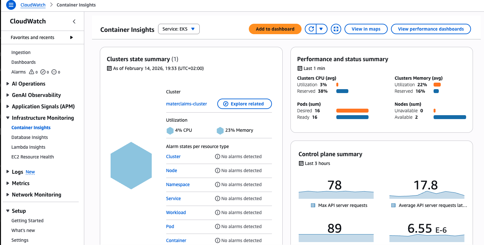

# Publishing Introspect2B Documentation to GitHub Pages

## 📋 Summary

Congratulations! The Introspect2B documentation has been successfully organized for GitHub Pages publication.

## 📂 Documentation Structure

```
docs/
├── _config.yml                          # Jekyll configuration
├── Gemfile                              # Ruby dependencies for local testing
├── README.md                            # Documentation guide
├── index.md                             # Landing page ✅
├── getting-started.md                   # Quick start guide ✅
├── api-reference.md                     # API documentation ✅
│
├── _layouts/                            # Custom layouts (optional)
├── assets/
│   └── css/
│       └── style.scss                   # Custom styling ✅
│
├── architecture/
│   ├── overview.md                      # System architecture ✅
│   └── extended.md                      # Intelligent autoscaling deep dive ✅
│
├── features/
│   └── intelligent-autoscaling.md       # Autoscaling feature docs ✅
│
├── deployment/
│   └── deployment-guide.md              # Complete deployment guide ✅
│
├── development/                         # Development guides (to be added)
│
└── media/                               # Images and diagrams
    ├── init-lab.png
    ├── wiki.png
    ├── workflow-list.png
    └── workflows-runs.png
```

## ✅ What's Been Created

### Core Documentation (Complete)
1. **Landing Page** ([index.md](index.md))
   - Overview with quick links
   - Key features
   - Architecture highlights
   - Technology stack

2. **Getting Started** ([getting-started.md](getting-started.md))
   - Prerequisites
   - Quick deploy (30 minutes)
   - GitHub Actions workflow
   - Manual Terraform deployment
   - Troubleshooting

3. **API Reference** ([api-reference.md](api-reference.md))
   - All endpoints documented
   - Request/response examples
   - Error handling
   - Sample data
   - Testing with cURL, Postman, Bruno

4. **Architecture Overview** ([architecture/overview.md](architecture/overview.md))
   - High-level architecture
   - Component descriptions
   - Security architecture
   - Scaling strategy
   - Performance characteristics

5. **Extended Architecture** ([architecture/extended.md](architecture/extended.md))
   - Intelligent autoscaling deep dive
   - Decision engine details
   - Monitoring strategy

6. **Intelligent Autoscaling** ([features/intelligent-autoscaling.md](features/intelligent-autoscaling.md))
   - Feature documentation
   - Implementation details
   - Configuration guide

7. **Deployment Guide** ([deployment/deployment-guide.md](deployment/deployment-guide.md))
   - Complete deployment walkthrough
   - Infrastructure setup
   - Application deployment

### Configuration Files (Complete)
1. **Jekyll Config** ([_config.yml](_config.yml))
   - Theme: Cayman
   - Plugins configured
   - Collections defined
   - Navigation structure

2. **Custom Styling** ([assets/css/style.scss](assets/css/style.scss))
   - Quick links styling
   - Info/warning boxes
   - Table enhancements
   - Code block improvements
   - Responsive design

3. **Gemfile** ([Gemfile](Gemfile))
   - Jekyll dependencies
   - GitHub Pages gem
   - Required plugins

## 🚀 Publishing to GitHub Pages

### Step 1: Enable GitHub Pages

1. Go to your repository: https://github.com/matei-tm/introspect2B
2. Click **Settings** → **Pages** (left sidebar)
3. Under **Build and deployment**:
   - Source: **Deploy from a branch**
   - Branch: **main**
   - Folder: **/docs**
4. Click **Save**

### Step 2: Wait for Build

GitHub Pages will automatically build your site (takes 1-3 minutes).

**Monitor progress:**
- Go to **Actions** tab
- Look for "pages build and deployment" workflow
- Wait for green checkmark ✅

### Step 3: Access Your Site

Once deployed, your documentation will be available at:

```
https://matei-tm.github.io/introspect2B/
```

## 🔍 Local Testing (Before Publishing)

Test the documentation locally before publishing:

```bash
# Navigate to docs folder
cd docs

# Install dependencies (first time only)
bundle install

# Serve locally
bundle exec jekyll serve

# Open in browser
open http://localhost:4000/introspect2B/
```

**Benefits of local testing:**
- ✅ Catch broken links
- ✅ Verify Mermaid diagrams render correctly
- ✅ Test navigation
- ✅ Check custom styling
- ✅ Preview before publishing

## 📝 Adding New Documentation

### Create a New Page

1. **Choose the appropriate folder**:
   - `docs/features/` for feature documentation
   - `docs/deployment/` for deployment guides
   - `docs/development/` for development guides
   - `docs/architecture/` for architecture docs

2. **Create Markdown file** with frontmatter:

```markdown
---
layout: default
title: Your Page Title
---

# Your Page Title

Your content here...
```

3. **Add to navigation** in `_config.yml`:

```yaml
header_pages:
  - index.md
  - getting-started.md
  - your-new-page.md  # Add here
```

4. **Test locally**:
```bash
bundle exec jekyll serve
```

5. **Commit and push**:
```bash
git add docs/your-new-page.md
git commit -m "docs: Add your new page"
git push
```

## 📊 Recommended Pages to Add

### High Priority
- [x] `features/genai-integration.md` - Bedrock integration details
- [x] `features/observability.md` - CloudWatch monitoring guide
- [ ] `deployment/github-actions.md` - CI/CD workflows documentation
- [x] `deployment/troubleshooting.md` - Common issues and solutions

### Medium Priority
- [ ] `development/local-setup.md` - Local development environment
- [ ] `development/testing.md` - Unit, integration, performance tests
- [ ] `development/contributing.md` - Contribution guidelines
- [x] `architecture/security.md` - Detailed security architecture

### Nice to Have
- [ ] `deployment/terraform.md` - IaC deep dive
- [ ] `deployment/cost-optimization.md` - AWS cost management
- [ ] `features/performance.md` - Performance tuning guide
- [ ] Blog posts or case studies

## 🎨 Customization Options

### Change Theme

Edit `_config.yml`:

```yaml
theme: jekyll-theme-minimal      # Minimal theme
# theme: jekyll-theme-cayman     # Current theme
# theme: jekyll-theme-slate      # Dark theme
# theme: jekyll-theme-architect  # Technical theme
```

### Add Custom Logo

1. Add logo to `docs/media/`
2. Update `_config.yml`:

```yaml
logo: /media/introspect2b-logo.png
```

### Enable Google Analytics

Update `_config.yml`:

```yaml
google_analytics: G-XXXXXXXXXX
```

### Add Social Links

Update `_config.yml`:

```yaml
twitter:
  username: your_twitter
  card: summary_large_image
github_username: matei-tm
```

## 🔗 Internal Linking Best Practices

### Relative Links
```markdown
[Getting Started](getting-started)
[Architecture](architecture/overview)
[API Reference](api-reference)
```

### Absolute Links (use sparingly)
```markdown
[External Resource](https://docs.aws.amazon.com/bedrock/)
```

## 🖼️ Adding Images

1. **Save images** to `docs/media/`:
```bash
docs/media/
├── CloudWatch.ContainerInsights.1.png
├── CloudWatch.LogsInsights.Query1.png
└── Dashboard.Cloudwatch.Bedrock.png
```

2. **Reference in Markdown**:
```markdown

```

3. **With caption**:
```markdown

*Figure 1: Example operational query output*
```

## 📈 Tracking & Analytics

### View Page Analytics

After enabling Google Analytics:

1. Go to [Google Analytics](https://analytics.google.com/)
2. Select your property
3. View:
   - Page views
   - User engagement
   - Traffic sources
   - Popular pages

### GitHub Insights

Track repository traffic:

1. Go to repository **Insights** tab
2. View:
   - Views
   - Unique visitors
   - Popular content
   - Referring sites

## 🐛 Troubleshooting

### Site Not Building

**Check Actions tab:**
- Look for failed workflow runs
- Read error messages

**Common issues:**
- Invalid YAML in `_config.yml`
- Missing frontmatter in Markdown files
- Broken internal links

### Pages Not Found (404)

**Check:**
- File paths are correct (case-sensitive)
- Files have `.md` extension
- Frontmatter is present
- Files are in `main` branch `docs/` folder

### Styling Not Applied

**Verify:**
- `assets/css/style.scss` has correct frontmatter (`---` at top)
- Jekyll is importing theme correctly
- Browser cache is cleared (hard refresh)

### Mermaid Diagrams Not Rendering

**Options:**
1. Use Mermaid Live Editor plugin
2. Add Mermaid JavaScript to custom layout
3. Convert diagrams to images

## 📦 Deployment Checklist

Before going live:

- [ ] All pages have proper frontmatter
- [ ] Internal links are working
- [ ] Images are optimized and loading
- [ ] Mermaid diagrams render correctly
- [ ] Code examples are tested
- [ ] Spelling and grammar checked
- [ ] Mobile responsiveness verified
- [ ] Local preview looks good
- [ ] README.md is comprehensive
- [ ] License file is present

## 🔄 Updating Documentation

### Regular Updates

1. **Make changes** in `docs/` folder
2. **Test locally**:
   ```bash
   cd docs
   bundle exec jekyll serve
   ```
3. **Commit changes**:
   ```bash
   git add docs/
   git commit -m "docs: Update XYZ documentation"
   ```
4. **Push to GitHub**:
   ```bash
   git push origin main
   ```
5. **Wait 1-3 minutes** for automatic rebuild

### Version Documentation

For major releases, consider:
- Creating version-specific folders (`docs/v1.0/`, `docs/v2.0/`)
- Maintaining a changelog
- Adding version selector in navigation

## 📞 Support & Resources

### Documentation
- [GitHub Pages Docs](https://docs.github.com/en/pages)
- [Jekyll Documentation](https://jekyllrb.com/docs/)
- [Markdown Guide](https://www.markdownguide.org/)
- [Mermaid Diagram Syntax](https://mermaid.js.org/)

### Community
- [Jekyll Talk Forum](https://talk.jekyllrb.com/)
- [GitHub Community](https://github.community/)

### Repository
- [Report Issues](https://github.com/matei-tm/introspect2B/issues)
- [Discussions](https://github.com/matei-tm/introspect2B/discussions)

## 🎉 Next Steps

1. **Review the documentation**: Check all pages for accuracy
2. **Enable GitHub Pages**: Follow Step 1 above
3. **Share the link**: https://matei-tm.github.io/introspect2B/
4. **Add remaining pages**: See "Recommended Pages to Add" section
5. **Gather feedback**: Ask users for suggestions
6. **Iterate**: Continuously improve documentation

---

**Documentation Status**: ✅ Ready for publication  
**Estimated Setup Time**: 2-3 minutes  
**Estimated Build Time**: 1-3 minutes  
**Live URL**: https://matei-tm.github.io/introspect2B/ (after enabling)

**Questions?** Open an issue or discussion on GitHub!
