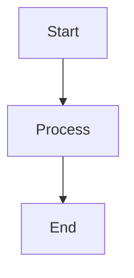

# Introspect2B Documentation

This folder contains the comprehensive documentation for Introspect2B, organized for GitHub Pages publication.

## 📚 Documentation Structure

```
docs/
├── _config.yml                          # Jekyll configuration
├── index.md                             # Landing page
├── getting-started.md                   # Quick start guide
├── api-reference.md                     # API documentation
├── architecture/
│   ├── overview.md                      # System architecture
│   ├── extended.md                      # Intelligent autoscaling deep dive
│   └── security.md                      # Security architecture
├── features/
│   ├── intelligent-autoscaling.md       # Autoscaling feature docs
│   ├── genai-integration.md             # Bedrock integration
│   └── observability.md                 # Monitoring and logging
├── deployment/
│   ├── deployment-guide.md              # Complete deployment guide
│   └── troubleshooting.md               # Common issues
├── development/
│   └── (planned guides)
├── lab-coverage.md                      # Lab objective-to-evidence mapping
├── evaluation-readiness.md              # Evaluation criteria coverage matrix
└── media/                               # Images and diagrams
    ├── init-lab.png
    ├── wiki.png
    ├── workflow-list.png
    └── workflows-runs.png
```

## 🌐 GitHub Pages Setup

### Enabling GitHub Pages

1. Go to repository **Settings** → **Pages**
2. Set **Source** to "Deploy from a branch"
3. Select branch: **main**
4. Set folder: **/docs**
5. Click **Save**

GitHub Pages will be available at:
```
https://matei-tm.github.io/introspect2B/
```

### Local Preview

To preview the documentation locally:

```bash
# Install Jekyll
gem install bundler jekyll

# Navigate to docs folder
cd docs

# Create Gemfile (if not exists)
cat > Gemfile << 'EOF'
source 'https://rubygems.org'
gem 'github-pages', group: :jekyll_plugins
gem 'jekyll-seo-tag'
EOF

# Install dependencies
bundle install

# Serve locally
bundle exec jekyll serve

# Open in browser
open http://localhost:4000/introspect2B/
```

### Theme

The documentation uses the **Cayman** theme, which provides:
- Clean, professional design
- Responsive layout
- Syntax highlighting
- Mobile-friendly navigation

## 📝 Writing Documentation

### Frontmatter

Each Markdown file should include YAML frontmatter:

```yaml
---
layout: default
title: Page Title
---
```

### Mermaid Diagrams

Mermaid diagrams are supported:

````markdown

````

### Code Blocks

Use fenced code blocks with language specification:

````markdown
```bash
echo "Hello, World!"
```

```json
{
  "key": "value"
}
```
````

### Internal Links

Use relative links for internal navigation:

```markdown
[Getting Started](getting-started)
[Architecture Overview](architecture/overview)
```

### Images

Store images in the `media/` folder:

```markdown

```

## 🔗 Quick Links

### Main Documentation Pages

- [Home](index.md) - Landing page with overview
- [Getting Started](getting-started.md) - Quick deployment guide
- [API Reference](api-reference.md) - Complete API documentation
- [Architecture Overview](architecture/overview.md) - System design
- [Security Architecture](architecture/security.md) - Access control and compliance baseline
- [GenAI Integration](features/genai-integration.md) - Bedrock request/response flow
- [Observability](features/observability.md) - Logs, metrics, and query strategy
- [Intelligent Autoscaling](features/intelligent-autoscaling.md) - Autoscaling deep dive
- [Deployment Guide](deployment/deployment-guide.md) - Full deployment walkthrough
- [Lab Objectives Coverage](lab-coverage.md) - Objective-by-objective evidence
- [Evaluation Readiness](evaluation-readiness.md) - Criteria-to-doc traceability

## 🎨 Customization

### Custom CSS

Create `assets/css/style.scss` to override theme styles:

```scss
---
---

@import "{{ site.theme }}";

/* Custom styles */
.quick-links {
  display: flex;
  gap: 1rem;
  margin: 2rem 0;
}

.btn {
  display: inline-block;
  padding: 0.75rem 1.5rem;
  background: #159957;
  color: white;
  text-decoration: none;
  border-radius: 4px;
}
```

### Custom Layout

Create `_layouts/default.html` to customize the page layout:

```html
<!DOCTYPE html>
<html lang="{{ site.lang | default: 'en-US' }}">
<head>
  <meta charset="UTF-8">
  <title>{{ page.title }} | {{ site.title }}</title>
  <!-- Add custom head content -->
</head>
<body>
  {{ content }}
</body>
</html>
```

## 🚀 Deployment

### Automatic Deployment

GitHub Pages automatically rebuilds the site when changes are pushed to the `main` branch in the `docs/` folder.

### Build Time

Typical build time: 1-3 minutes

### Cache Invalidation

If changes don't appear immediately:
1. Wait 3-5 minutes for cache to clear
2. Hard refresh browser (Ctrl+Shift+R or Cmd+Shift+R)
3. Check Actions tab for build status

## 📦 Assets

### Images

Store screenshots, diagrams, and other images in `docs/media/`:

```
docs/media/
├── CloudWatch.ContainerInsights.1.png
├── CloudWatch.LogsInsights.Query1.png
├── Dashboard.Cloudwatch.Bedrock.png
└── CodePipeline.claim-status-api-pipeline.png
```

Reference in Markdown:
```markdown

```

### Downloads

For downloadable files (Postman collections, sample data):

```
docs/downloads/
├── postman-collection.json
├── sample-claims.json
└── terraform-variables.tfvars.example
```

## 🔍 SEO Optimization

The site includes `jekyll-seo-tag` plugin for:
- Meta tags
- Open Graph tags
- Twitter Card tags
- JSON-LD structured data

Configure in `_config.yml`:

```yaml
title: Introspect2B
description: GenAI-Powered Cloud-Native Claim Status API
twitter:
  username: your_twitter
  card: summary_large_image
logo: /media/logo.png
```

## 📊 Analytics

To add Google Analytics:

1. Create `_includes/head-custom.html`:

```html
<!-- Google Analytics -->
<script async src="https://www.googletagmanager.com/gtag/js?id=GA_MEASUREMENT_ID"></script>
<script>
  window.dataLayer = window.dataLayer || [];
  function gtag(){dataLayer.push(arguments);}
  gtag('js', new Date());
  gtag('config', 'GA_MEASUREMENT_ID');
</script>
```

2. Reference: `_config.yml`:

```yaml
google_analytics: GA_MEASUREMENT_ID
```

## 🤝 Contributing

To contribute to documentation:

1. Fork the repository
2. Create a feature branch: `git checkout -b docs/new-feature`
3. Make changes in the `docs/` folder
4. Test locally: `bundle exec jekyll serve`
5. Commit: `git commit -am "docs: Add new feature documentation"`
6. Push: `git push origin docs/new-feature`
7. Create a Pull Request

### Documentation Standards

- Use clear, concise language
- Include code examples
- Add diagrams for complex concepts
- Test all commands and code samples
- Follow the existing structure and style
- Add frontmatter to all Markdown files
- Use proper heading hierarchy (H1 → H2 → H3)

## 📞 Support

For questions or issues with the documentation:

- 🐛 [Report an Issue](https://github.com/matei-tm/introspect2B/issues)
- 💬 [Start a Discussion](https://github.com/matei-tm/introspect2B/discussions)
- 📧 Contact the maintainers

## 📄 License

This documentation is part of the Introspect2B project and is licensed under the MIT License.

---

**Last Updated**: February 2026  
**Version**: 1.0  
**Maintained By**: [matei-tm](https://github.com/matei-tm)
