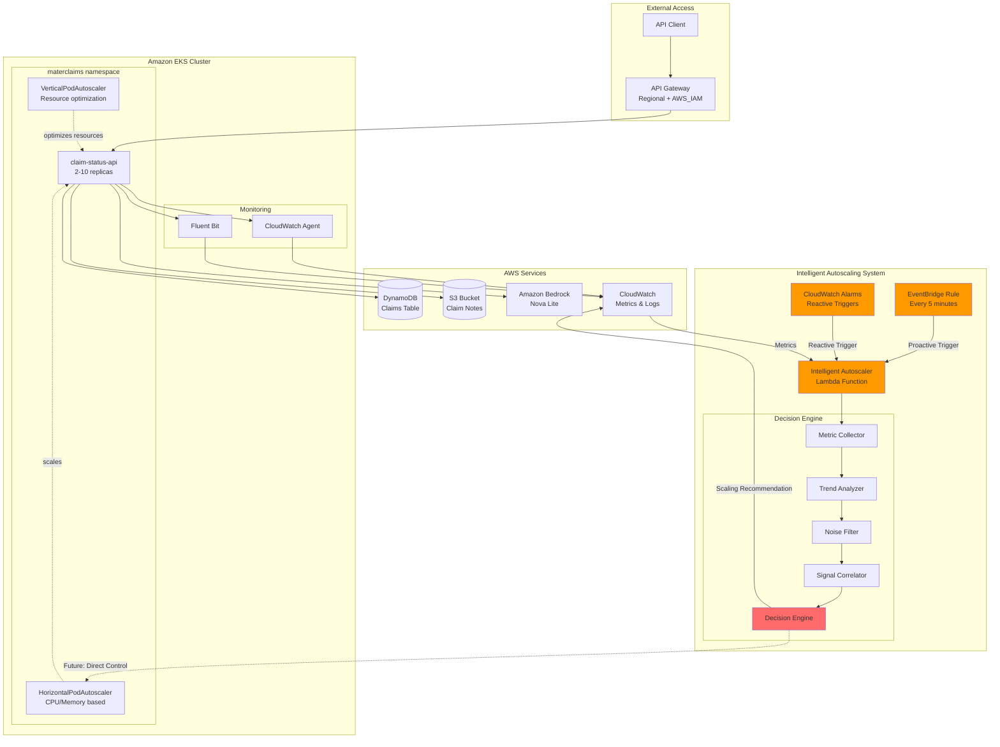

# Extended Architecture with Intelligent Autoscaling

## System Overview



## Component Details

### 1. API Layer

**API Gateway**
- Regional endpoint with AWS_IAM authentication
- Throttling and rate limiting
- Request/response transformations
- CloudWatch logging enabled

**claim-status-api Service**
- .NET 10 WebAPI running on EKS
- 2-10 replicas (dynamic based on load)
- Endpoints:
  - `GET /api/claims/{id}` - Retrieve claim status
  - `POST /api/claims/{id}/summarize` - Generate AI summary

### 2. Data & AI Services

**DynamoDB**
- Table: `claims`
- On-demand billing
- Point-in-time recovery enabled
- Stores claim metadata and status

**S3 Bucket**
- Bucket: `claim-notes-{account-id}`
- Versioning enabled
- Server-side encryption (AES256)
- Stores detailed claim notes

**Amazon Bedrock**
- Model: Amazon Nova Lite
- Use case: Claim summarization
- Average inference time: 2-4 seconds
- Variable latency based on prompt complexity

### 3. Traditional Autoscaling

**HorizontalPodAutoscaler (HPA)**
- Metrics: CPU (70%), Memory (80%)
- Min replicas: 2
- Max replicas: 10
- Scale-down stabilization: 5 minutes
- Scale-up: Immediate

**VerticalPodAutoscaler (VPA)**
- Mode: "Initial" (no pod disruption)
- Min resources: 100m CPU, 256Mi memory
- Max resources: 2000m CPU, 2Gi memory
- Updates applied to new pods only

### 4. Intelligent Autoscaling System ⭐ NEW

#### Lambda Function
- **Runtime:** Python 3.11
- **Memory:** 256 MB
- **Timeout:** 5 minutes
- **Triggers:** 
  - EventBridge (every 5 minutes) - Proactive mode
  - CloudWatch Alarms - Reactive mode

#### Decision Engine Components

**1. Metric Collector**
Gathers metrics from CloudWatch:
- Pod CPU utilization (ContainerInsights)
- Pod memory utilization (ContainerInsights)
- API latency (Custom metric)
- Bedrock inference duration (Custom metric)

**2. Trend Analyzer**
- Uses linear regression on 10-minute rolling window
- Calculates trend direction: increasing/stable/decreasing
- Computes trend magnitude (% change rate)
- Threshold: 15% change = significant trend

**3. Noise Filter**
- Calculates coefficient of variation
- Filters transient spikes (<5% variation)
- Distinguishes model loading from sustained load
- Prevents premature scaling actions

**4. Signal Correlator**
Requires **multiple confirming signals** before action:
- Scale up: ≥2 metrics showing increasing trend + high utilization
- Scale down: ≥2 metrics showing decreasing trend + low utilization
- No action: Insufficient correlated signals

**5. Decision Engine**
Makes final scaling determination:
- **Action:** scale_up / scale_down / none
- **Mode:** proactive (scheduled) / reactive (alarm)
- **Reasoning:** Full explanation with metric analysis
- **Metrics:** Complete snapshot of evaluated data

#### CloudWatch Alarms (Reactive Triggers)

**API Latency High Alarm**
- Threshold: >5 seconds average
- Evaluation: 2 consecutive periods
- Action: Immediate Lambda invocation

**Bedrock Duration High Alarm**
- Threshold: >4 seconds average
- Evaluation: 3 consecutive periods
- Indicates: Bedrock concurrency limits hit
- Action: Lambda invocation for scale-up evaluation

#### Metrics Published

**Namespace:** `IntelligentAutoscaler`

| Metric | Values | Meaning |
|--------|--------|---------|
| ScalingDecision | 1, -1, 0 | Scale up, down, or no action |
| ExecutionSuccess | 1, 0 | Lambda execution result |
| ExecutionFailure | count | Failure events |

**Dimensions:** ClusterName, Namespace, Deployment

### 5. Observability

**CloudWatch Container Insights**
- Pod-level CPU/memory metrics
- Node-level resource utilization
- Network traffic metrics

**Custom Application Metrics**
- API request latency (p50, p95, p99)
- Bedrock invocation count and duration
- Error rates by endpoint

**CloudWatch Logs**
- Application logs (via Fluent Bit)
- Lambda execution logs
- EKS control plane logs

**CloudWatch Dashboard**
- Intelligent Autoscaler performance
- Pod resource utilization trends
- API and Bedrock performance
- Recent scaling decisions with reasoning

## Data Flow

### Standard API Request Flow

```
1. Client sends request to API Gateway
2. API Gateway validates AWS_IAM credentials
3. Request forwarded to EKS claim-status-api service
4. Service queries DynamoDB for claim metadata
5. Service retrieves claim notes from S3 (if needed)
6. Response returned to client
```

### AI Summarization Flow

```
1. Client requests claim summary via API Gateway
2. claim-status-api retrieves claim notes from S3
3. Service constructs prompt and calls Bedrock (Nova Lite)
4. Bedrock processes prompt (2-4 second inference time)
5. Service parses AI-generated JSON summary
6. Summary returned to client
```

### Intelligent Autoscaling Flow

#### Proactive Mode (Every 5 minutes)
```
1. EventBridge triggers Lambda on schedule
2. Lambda collects 10-minute metric history from CloudWatch
3. For each metric:
   a. Calculate trend (linear regression)
   b. Apply noise filter (coefficient of variation)
   c. Classify as signal or noise
4. Correlate signals across all metrics
5. If ≥2 metrics show correlated trend + threshold breach:
   a. Generate scaling decision with reasoning
   b. Publish decision to CloudWatch metrics
   c. Log detailed explanation
6. Future: Update HPA min/max or deployment replicas
```

#### Reactive Mode (Alarm triggered)
```
1. CloudWatch alarm threshold breached (e.g., API latency >5s)
2. Alarm immediately invokes Lambda
3. Lambda evaluates current state + trends
4. Decision made with "reactive" mode flag
5. Faster response for urgent conditions
```

## Scaling Logic

### Decision Matrix

| CPU | Memory | Latency | Bedrock | Correlated Signals | Decision |
|-----|--------|---------|---------|-------------------|----------|
| ↑ High | ↑ High | ↑ High | - | 3 | **Scale Up** |
| ↑ High | ↑ High | - | ↑ High | 3 | **Scale Up** |
| ↑ High | - | ↑ High | - | 2 | **Scale Up** |
| ↓ Low | ↓ Low | - | - | 2 | **Scale Down** |
| ↑ High | Stable | Stable | Stable | 1 | **No Action** (noise) |
| Stable | Stable | Stable | Stable | 0 | **No Action** |

### AI Workload Context

**Why standard HPA alone isn't enough:**
1. **Variable Bedrock latency** - Inference times vary 1-10 seconds
2. **Cold starts** - Model loading causes temporary memory spikes
3. **Concurrent request limits** - Bedrock throttling not visible in pod metrics
4. **Queue depth** - Requests waiting for Bedrock slots don't show as CPU load

**How intelligent autoscaler helps:**
1. Monitors **Bedrock inference duration** as primary signal
2. Understands **high latency is normal** for AI workloads
3. Detects **sustained increases** (concurrency limits) vs transient spikes
4. Scales **before** traditional CPU/memory thresholds are hit
5. **Avoids unnecessary scaling** during model initialization

## Deployment Sequence

### Initial Setup
```bash
1. Deploy Terraform infrastructure
   cd iac/terraform && terraform apply
   
2. Verify Lambda deployment
   aws lambda get-function --function-name introspect2b-eks-intelligent-autoscaler
   
3. Check EventBridge rule
   aws events list-rules --name-prefix introspect2b
   
4. Monitor first execution
   aws logs tail /aws/lambda/introspect2b-eks-intelligent-autoscaler --follow
```

### Monitoring Autoscaler
```bash
# View dashboard
https://console.aws.amazon.com/cloudwatch/home#dashboards:name=introspect2b-eks-intelligent-autoscaler

# Check recent scaling decisions
aws logs filter-log-events \
  --log-group-name /aws/lambda/introspect2b-eks-intelligent-autoscaler \
  --filter-pattern '{ $.decision.action != "none" }' \
  --start-time $(date -u -d '1 hour ago' +%s)000

# View metrics
aws cloudwatch get-metric-statistics \
  --namespace IntelligentAutoscaler \
  --metric-name ScalingDecision \
  --dimensions Name=ClusterName,Value=introspect2b-eks \
  --start-time 2026-02-14T00:00:00Z \
  --end-time 2026-02-14T23:59:59Z \
  --period 300 \
  --statistics Sum
```

## Configuration Tuning

### Conservative Configuration
For stable workloads with predictable patterns:
```hcl
METRIC_WINDOW_MINUTES  = 15      # Longer trend window
TREND_THRESHOLD        = 0.25    # Require 25% change
NOISE_FILTER_THRESHOLD = 0.10    # Higher noise tolerance
```

### Aggressive Configuration
For bursty workloads requiring fast response:
```hcl
METRIC_WINDOW_MINUTES  = 5       # Shorter trend window
TREND_THRESHOLD        = 0.10    # Trigger on 10% change
NOISE_FILTER_THRESHOLD = 0.03    # Lower noise tolerance
```

### AI-Optimized Configuration (Recommended)
Balanced for Bedrock-heavy workloads:
```hcl
METRIC_WINDOW_MINUTES  = 10      # Medium trend window
TREND_THRESHOLD        = 0.15    # 15% change threshold
NOISE_FILTER_THRESHOLD = 0.05    # 5% noise filter
```

## Cost Considerations

### Lambda Costs
- **Invocations:** 288/day (every 5 min) + reactive alarms
- **Duration:** ~5 seconds per invocation
- **Memory:** 256 MB
- **Estimated cost:** $0.10/month (within free tier)

### CloudWatch Costs
- **Custom metrics:** 4 metrics × $0.30/month = $1.20/month
- **Alarms:** 2 alarms × $0.10/month = $0.20/month
- **Log ingestion:** ~$0.50/month
- **Dashboard:** Free (up to 3)

### Total Additional Cost
**~$2-3/month** for intelligent autoscaling capabilities

### ROI Calculation
- Prevents over-provisioning: Save ~20-30% on pod resources
- Prevents under-provisioning: Avoid SLA violations
- Typical savings: $50-100/month on compute costs
- **Net savings: $47-98/month**

## Future Enhancements

### Phase 2: Direct Kubernetes Integration
- Use Kubernetes Python client to update HPA dynamically
- Adjust HPA min/max based on predicted demand
- Coordinate with cluster autoscaler for node scaling

### Phase 3: Machine Learning
- Train ML model on historical scaling patterns
- Predict future demand based on time of day, day of week
- Integrate with business calendar (e.g., month-end processing spikes)

### Phase 4: Multi-Cluster Coordination
- Share scaling decisions across regions
- Route traffic to less-loaded clusters
- Global optimization of compute resources

### Phase 5: Cost-Aware Scaling
- Factor in EC2 Spot instance pricing
- Delay non-urgent scale-ups for cheaper instance availability
- Report cost savings from scaling decisions

## References

- [AI Autoscaling Instructions](../instructions/ai-autoscaling.instructions.md)
- [Intelligent Autoscaler Source Code](../../src/intelligent-autoscaler/)
- [CloudWatch Container Insights](https://docs.aws.amazon.com/AmazonCloudWatch/latest/monitoring/ContainerInsights.html)
- [Amazon Bedrock Performance Guide](https://docs.aws.amazon.com/bedrock/latest/userguide/inference-performance.html)
