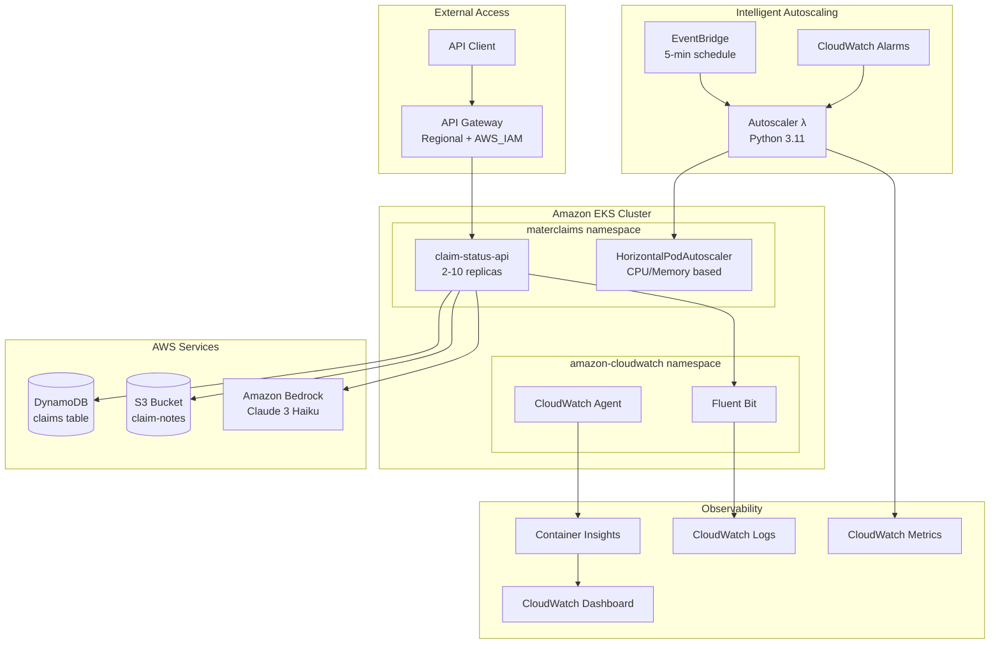
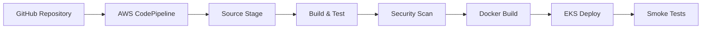

# System Architecture Overview

Introspect2B implements a cloud-native, microservices-based architecture on AWS, demonstrating best practices for GenAI integration, intelligent autoscaling, and enterprise-grade observability.

## High-Level Architecture



## Core Components

### 1. API Layer

**Amazon API Gateway (Regional)**
- **Endpoint Type**: Regional (low latency within AWS region)
- **Authentication**: AWS_IAM (SigV4 signing)
- **Features**:
  - Request/response validation
  - API key management
  - Throttling and rate limiting
  - CloudWatch integration for metrics

**Claim Status API (.NET 10)**
- **Framework**: ASP.NET Core Minimal API
- **Replicas**: 2-10 (autoscaling enabled)
- **Health Checks**: Built-in liveness/readiness probes
- **Endpoints**:
  - `GET /api/claims/{id}` - Retrieve claim details
  - `POST /api/claims/{id}/summarize` - Generate AI summary
  - `GET /health` - Health check
  - `GET /swagger` - API documentation

### 2. Compute Layer

**Amazon EKS 1.31**
- **Node Group**: 2 x t3.medium instances
- **Networking**: VPC with public/private subnets across 2 AZs
- **Add-ons**:
  - CoreDNS for service discovery
  - VPC CNI for pod networking
  - EKS Pod Identity Agent for IRSA
  - Amazon CloudWatch Observability for monitoring
- **Autoscaling**:
  - Horizontal Pod Autoscaler (HPA) for pod scaling
  - Cluster Autoscaler for node scaling
  - Intelligent Lambda autoscaler for workload-aware scaling

**Kubernetes Resources**
- **Namespace**: `materclaims` (application), `amazon-cloudwatch` (monitoring)
- **Service Account**: `claim-status-api-sa` with IRSA
- **Deployment**: `claim-status-api` (2-10 replicas)
- **Service**: ClusterIP (internal), LoadBalancer (via API Gateway)

### 3. Data Layer

**Amazon DynamoDB**
- **Table**: `claims`
- **Primary Key**: `id` (String)
- **Attributes**:
  - `status`, `claimType`, `submissionDate`
  - `claimantName`, `amount`, `notesKey`
- **Provisioning**: On-demand billing
- **Access**: Via IRSA (least-privilege IAM policy)

**Amazon S3**
- **Bucket**: `claim-notes-{account-id}`
- **Purpose**: Store detailed claim notes (text blobs)
- **Encryption**: SSE-S3 (server-side encryption)
- **Access**: Via IRSA with read-only permissions

### 4. AI/ML Layer

**Amazon Bedrock**
- **Model**: Claude 3 Haiku (`anthropic.claude-3-haiku-20240307-v1:0`)
- **Use Case**: Generate contextual claim summaries
- **Features**:
  - Multi-perspective summaries (customer, adjuster, overall)
  - Recommended next steps
  - Structured JSON responses
- **Access**: Via IRSA with `InvokeModel` permission

### 5. Intelligent Autoscaling System

**AWS Lambda Function (Python 3.11)**
- **Memory**: 256 MB
- **Timeout**: 5 minutes
- **Triggers**:
  - **Proactive**: EventBridge (every 5 minutes) for trend analysis
  - **Reactive**: CloudWatch Alarms for threshold breaches
- **Features**:
  - Linear regression trend analysis
  - Coefficient of variation noise filtering
  - Multi-metric correlation (CPU, memory, latency, Bedrock)
  - Explainable decisions with CloudWatch Logs audit trail

**Decision Engine**
- **Metrics Analyzed**:
  - `pod_cpu_utilization` (Container Insights)
  - `pod_memory_utilization` (Container Insights)
  - `ClaimStatusApi_request_duration_seconds` (custom metric)
  - `BedrockInvocationDuration` (custom metric)
- **Scaling Logic**:
  - **Scale Up**: ≥2 metrics show increasing trend + low noise
  - **Scale Down**: ≥2 metrics show decreasing trend + below threshold
  - **No Action**: Stable trends or insufficient correlated signals

### 6. Observability Stack

**CloudWatch Logs**
- **Log Groups**:
  - `/aws/containerinsights/materclaims-cluster/application` - Application logs
  - `/aws/lambda/intelligent-autoscaler` - Autoscaler Lambda logs
  - `/aws/codebuild/*` - CI/CD build logs
- **Insights Queries**: 8 pre-built queries for diagnostics

**CloudWatch Metrics**
- **Container Insights**: Pod/node CPU, memory, network metrics
- **Custom Metrics**:
  - `ScalingDecision` (1=up, 0=none, -1=down)
  - `ConfirmingSignals` (number of correlated metrics)
  - `TrendDirection` (slope of metric trends)
- **Alarms**:
  - API latency > 5 seconds
  - Bedrock invocation > 4 seconds

**CloudWatch Dashboard**
- Pod CPU/Memory utilization
- Scaling decisions over time
- Bedrock invocation metrics
- API request latency

## Security Architecture

### Identity and Access Management

**IRSA (IAM Roles for Service Accounts)**
```
Kubernetes ServiceAccount → IAM Role → AWS Services
```

- **Principle**: Least privilege access
- **Benefits**:
  - No hardcoded credentials
  - Fine-grained permissions per pod
  - Temporary credentials via STS
  - Automatic rotation

**IAM Policies**
- **DynamoDB**: `GetItem`, `Scan` (read-only)
- **S3**: `GetObject` (read-only on `claim-notes-*` bucket)
- **Bedrock**: `InvokeModel` (Claude 3 Haiku only)
- **CloudWatch**: `PutMetricData`, `GetMetricStatistics`

### Network Security

**VPC Configuration**
- **CIDR**: 10.0.0.0/16
- **Subnets**:
  - Public: 10.0.1.0/24, 10.0.2.0/24 (NAT gateways, load balancers)
  - Private: 10.0.3.0/24, 10.0.4.0/24 (EKS nodes, pods)
- **Security Groups**:
  - EKS cluster SG (control plane communication)
  - Node SG (pod-to-pod, pod-to-service)
  - ALB SG (ingress from internet)

**API Gateway Security**
- AWS_IAM authentication (SigV4 signing required)
- API key for additional access control
- Request validation and throttling
- Private VPC integration (optional)

### Data Protection

- **At Rest**: S3 SSE-S3 encryption, DynamoDB encryption
- **In Transit**: TLS 1.2+ for all API calls
- **Secrets**: AWS Secrets Manager (not implemented in this demo)

## Scaling Strategy

### Horizontal Pod Autoscaling (HPA)

```yaml
minReplicas: 2
maxReplicas: 10
targetCPUUtilizationPercentage: 70
targetMemoryUtilizationPercentage: 80
```

- **Reactive**: Scales based on current CPU/memory usage
- **Response Time**: 30-60 seconds
- **Limitations**: Can't predict upcoming load spikes

### Intelligent Autoscaling (Lambda)

- **Proactive**: Analyzes trends to predict scaling needs
- **Multi-Metric**: Correlates CPU, memory, latency, Bedrock metrics
- **Noise Filtering**: Distinguishes real patterns from transient spikes
- **Explainability**: Logs detailed decision rationale

**Scaling Decision Flow**:
```
1. Collect metrics (last 10 minutes)
2. Calculate trends (linear regression)
3. Filter noise (coefficient of variation)
4. Correlate signals (≥2 metrics required)
5. Make decision (scale up/down/none)
6. Publish custom metrics
7. Log decision for audit
```

[Learn more about Intelligent Autoscaling →](../features/intelligent-autoscaling)

## Deployment Pipeline

### CI/CD Architecture



**Stages**:
1. **Source**: GitHub webhook trigger
2. **Build & Test**: .NET unit tests, Python Lambda tests
3. **Security**: AWS Inspector, Microsoft Defender scans
4. **Docker**: Build and push to ECR
5. **Deploy**: Update EKS deployment
6. **Verify**: Health checks and smoke tests

## Infrastructure as Code

**Terraform Modules** (`iac/terraform/`)
- `vpc.tf` - VPC, subnets, routing
- `eks.tf` - EKS cluster, node groups
- `iam.tf` - IAM roles and policies (IRSA)
- `cloudwatch.tf` - Logging, monitoring, Container Insights
- `lambda-autoscaler.tf` - Intelligent autoscaling Lambda
- `security.tf` - Security groups, NACLs

**CloudFormation** (`apigw/`)
- API Gateway REST API
- API Gateway deployment and stage
- API key and usage plan

## Performance Characteristics

### Latency

- **DynamoDB GetItem**: < 10ms (p99)
- **S3 GetObject**: < 50ms (p99, small objects)
- **Bedrock InvokeModel**: 2-4 seconds (depends on input length)
- **Total API Response**: 2.5-5 seconds (with AI summary)

### Throughput

- **API Gateway**: 10,000 requests/second (default limit)
- **EKS Pods**: ~100 requests/second per pod
- **DynamoDB**: On-demand (auto-scales)
- **Bedrock**: 1,000 tokens/minute per model (request quota increase if needed)

### Cost Optimization

- **EKS**: t3.medium nodes (cost-effective for demo)
- **DynamoDB**: On-demand (pay per request)
- **S3**: Standard class (infrequent access for claim notes)
- **Bedrock**: Pay per token (Claude 3 Haiku is cost-efficient)
- **Autoscaling**: Reduces idle pods during low traffic

## Disaster Recovery

### Backup Strategy

- **DynamoDB**: Point-in-time recovery (PITR) enabled
- **S3**: Versioning enabled
- **EKS**: GitOps approach (infrastructure as code)
- **Lambda**: Function versioning and aliases

### High Availability

- **Multi-AZ**: EKS nodes across 2 availability zones
- **Redundancy**: Minimum 2 pod replicas
- **Health Checks**: Kubernetes liveness/readiness probes
- **Auto-Recovery**: EKS auto-replaces failed nodes/pods

## Related Documentation

- [Extended Architecture (Intelligent Autoscaling Deep Dive)](extended)
- [Intelligent Autoscaling Feature](../features/intelligent-autoscaling) - How the system predicts and responds to workload changes
- [Getting Started Guide](../getting-started) - Deploy the system

---

**Next**: Explore [Intelligent Autoscaling](../features/intelligent-autoscaling) to learn how the system predicts and responds to workload changes.
