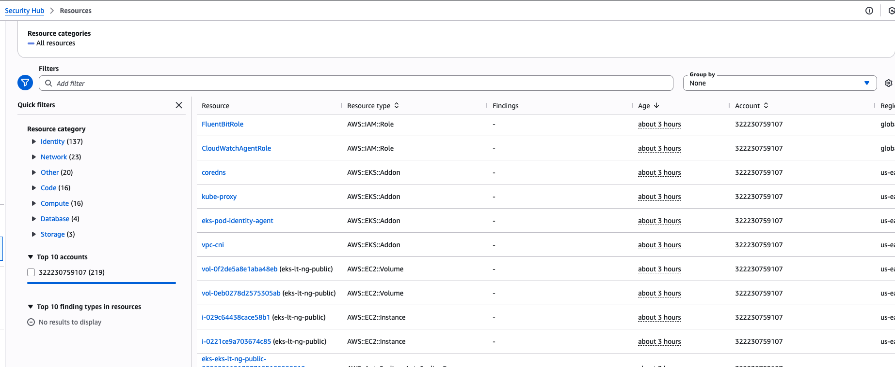

# Security Architecture

Concise security model for Introspect2B aligned to lab and evaluation criteria.

## Access Control

- **API Gateway** uses `AWS_IAM` request signing.
- **IRSA** maps Kubernetes service accounts to IAM roles.
- **Least privilege** policies are scoped to DynamoDB, S3, Bedrock, and CloudWatch actions.

## Data Protection

- **At rest:** DynamoDB encryption + S3 server-side encryption.
- **In transit:** TLS for API Gateway, AWS SDK calls, and Bedrock invocation.
- **Secrets:** No static credentials in code paths used by workloads.

## Runtime Security

- **Container scanning:** Amazon Inspector / ECR image scan results.
- **Central visibility:** Security Hub evidence and findings aggregation.
- **Pipeline gate:** dedicated security scan step in CI/CD.

*Centralized findings view used for continuous security review.*

## Compliance-Oriented Controls

This lab is not a full compliance implementation, but includes baseline controls relevant to regulated workloads:

- identity segmentation (IRSA)
- encrypted storage
- traceable audit logs
- vulnerability management in build and runtime

## Operational Checks

- Validate pod/service account role bindings.
- Validate CloudWatch Container Insights and audit logs are flowing.
- Validate security scan outputs are published in pipeline artifacts.

## Related Docs

- [System Architecture](overview)
- [Deployment Guide](../deployment/deployment-guide)
- [Evaluation Readiness](../evaluation-readiness)
