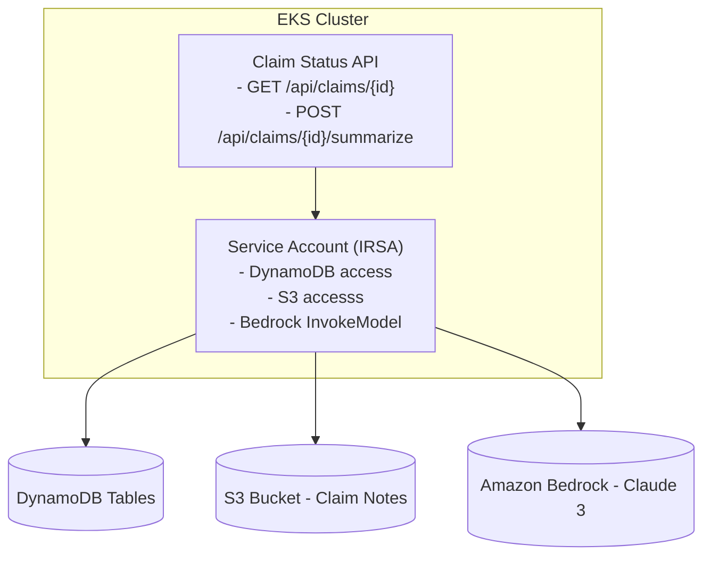

# GenAI-Enabled Claim Status API - Deployment Guide

## Overview

This guide walks through deploying the Claim Status API microservice to AWS EKS with Amazon Bedrock integration for AI-powered claim summaries.

## Prerequisites

- AWS Account with appropriate permissions
- Terraform installed (>= 1.0)
- kubectl configured for EKS access
- Docker installed (for local testing)
- .NET 10 SDK (optional, for local development)

## Architecture



## Deployment Steps

### Step 1: Prepare Infrastructure with Terraform

```bash
cd iac/terraform

# Initialize Terraform
terraform init

# Review changes
terraform plan

# Apply configuration (creates EKS, DynamoDB, S3, IAM roles)
terraform apply
```

**What gets created:**

- EKS Cluster with managed node groups
- VPC and networking
- DynamoDB table (`claims`)
- S3 bucket for claim notes
- IAM roles for IRSA
- ECR repository for container images

### Step 2: Build and Push Container Image

```bash
cd src/claim-status-api

# Set AWS variables
export AWS_REGION=us-east-1
export AWS_ACCOUNT_ID=$(aws sts get-caller-identity --query Account --output text)
export ECR_REPO=${AWS_ACCOUNT_ID}.dkr.ecr.${AWS_REGION}.amazonaws.com

# Build Docker image
docker build  --platform linux/amd64 -t claim-status-api:latest .

# Tag for ECR
docker tag claim-status-api:latest ${ECR_REPO}/claim-status-api:latest

# Login to ECR
aws ecr get-login-password --region ${AWS_REGION} | \
  docker login --username AWS --password-stdin ${ECR_REPO}

# Push to ECR
docker push ${ECR_REPO}/claim-status-api:latest
```

### Step 3: Deploy to EKS

```bash
cd src/claim-status-api

# Apply Kubernetes manifests
kubectl apply -f k8s/claim-status-api-deployment.yaml
kubectl apply -f k8s/claim-status-api-service.yaml

# Verify deployment
kubectl get pods -n materclaims -l app=claim-status-api
kubectl get svc -n materclaims claim-status-api
```

### Step 4: Initialize Sample Data

```bash
# Create sample claim in DynamoDB and S3
./scripts/init-sample-data.sh

# Verify data
aws dynamodb scan --table-name claims --region us-east-1
aws s3 ls s3://claim-notes-$(aws sts get-caller-identity --query Account --output text)/ --recursive
```

## Testing

### Local Testing

```bash
# Port forward the service
kubectl port-forward -n materclaims svc/claim-status-api 8080:80

# Test in another terminal
# 1. Get claim status
curl http://localhost:8080/api/claims/CLAIM-001

# 2. Generate summary
curl -X POST http://localhost:8080/api/claims/CLAIM-001/summarize \
  -H "Content-Type: application/json" \
  -d '{
    "notesOverride": "Customer reported water damage to kitchen and dining room after pipe burst. Damage estimated at $25,000. No previous claims."
  }'

# 3. Access Swagger UI
curl http://localhost:8080/swagger
```

### Check Logs

```bash
# View logs from all pods
kubectl logs -n materclaims -l app=claim-status-api -f

# View logs from specific pod
kubectl logs -n materclaims <pod-name> -f

# Get deployment details
kubectl describe deployment -n materclaims claim-status-api
```

### Monitor Health

```bash
# Health check endpoint
curl http://localhost:8080/health

# Check pod status
kubectl get pods -n materclaims -l app=claim-status-api

# Watch pod events
kubectl get events -n materclaims --sort-by='.lastTimestamp'
```

## Configuration

### Environment Variables

The service reads configuration from:
1. `appsettings.json` (defaults)
2. `appsettings.Development.json` (dev overrides)
3. Environment variables (runtime)

Key configurations:

```yaml
AWS:
  DynamoDb:
    TableName: claims
  S3:
    BucketName: claim-notes-{account-id}
  Bedrock:
    Region: us-east-1
```

### Kubernetes ConfigMap

Update service configuration:

```bash
kubectl set env deployment/claim-status-api \
  -n materclaims \
  AWS:S3:BucketName=my-custom-bucket
```

## Troubleshooting

### Pod won't start

```bash
# Check pod status and events
kubectl describe pod <pod-name> -n materclaims

# Check logs
kubectl logs <pod-name> -n materclaims

# Common issues:
# - Image not available in ECR: Re-push the image
# - Insufficient resources: Check node capacity
# - IAM permissions: Verify IRSA setup
```

### API returns 404

```bash
# Verify claim exists in DynamoDB
aws dynamodb get-item \
  --table-name claims \
  --key '{"id":{"S":"CLAIM-001"}}' \
  --region us-east-1
```

### S3 access errors

```bash
# Verify bucket exists and is accessible
aws s3 ls s3://claim-notes-{account-id}/ --region us-east-1

# Check IAM role permissions
aws iam get-role-policy \
  --role-name AppServiceAccountRole \
  --policy-name AppServiceAccountPolicy
```

### Bedrock errors

```bash
# Verify Bedrock is available in your region
aws bedrock list-foundation-models --region us-east-1

# Check model availability
aws bedrock describe-foundation-model \
  --model-identifier anthropic.claude-3-haiku-20240307-v1:0 \
  --region us-east-1
```

## Production Checklist

- [ ] Configure CloudWatch logging
- [ ] Set up monitoring and alerts
- [ ] Enable request rate limiting
- [ ] Configure HTTPS/TLS
- [ ] Set up API Gateway or ingress controller
- [ ] Configure backup strategy for DynamoDB
- [ ] Set up auto-scaling policies
- [ ] Implement request authentication/authorization
- [ ] Configure network policies
- [ ] Set up disaster recovery procedures

## Cleanup

To remove all resources:

```bash
# Delete Kubernetes resources
kubectl delete deployment -n materclaims claim-status-api
kubectl delete svc -n materclaims claim-status-api

# Destroy Terraform resources
cd iac/terraform
terraform destroy
```

## Next Steps

1. **Add API Gateway**: Expose the service externally
2. **Implement Authentication**: Add JWT/OAuth2
3. **Add Rate Limiting**: Protect against abuse
4. **Setup Monitoring**: CloudWatch dashboards and alarms
5. **Create CI/CD Pipeline**: GitHub Actions/CodePipeline
6. **Add Unit Tests**: Improve code coverage
7. **Performance Optimization**: Caching, connection pooling
8. **Load Testing**: Verify capacity and performance

## Support

For issues, errors, or questions:

1. Check the logs: `kubectl logs -n materclaims -l app=claim-status-api -f`
2. Review AWS service quotas
3. Verify IAM permissions
4. Check Bedrock model availability
5. Contact the platform team

## Additional Resources

- [AWS SDK for .NET Documentation](https://docs.aws.amazon.com/sdk-for-net/)
- [Amazon Bedrock Documentation](https://docs.aws.amazon.com/bedrock/)
- [Amazon DynamoDB Documentation](https://docs.aws.amazon.com/dynamodb/)
- [EKS Best Practices](https://aws.github.io/aws-eks-best-practices/)
- [Kubernetes Documentation](https://kubernetes.io/docs/)
