# Evidence Gallery

Concise visual evidence index for CI/CD, observability, security, and API operations.

## API Gateway and API

*API Gateway dashboard summary.*

*API Gateway resources for claim-status-api environment.*

## CloudWatch and Container Insights

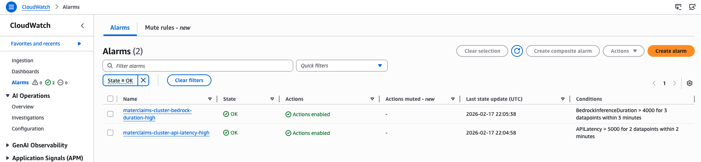
*Alarm state overview for runtime conditions.*

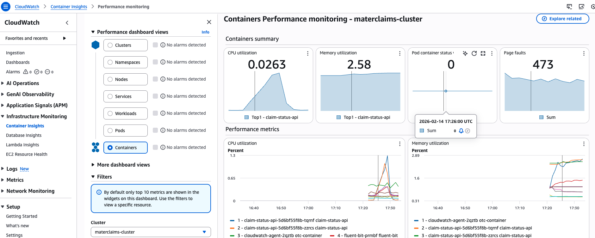
*Additional Container Insights view for cluster telemetry.*

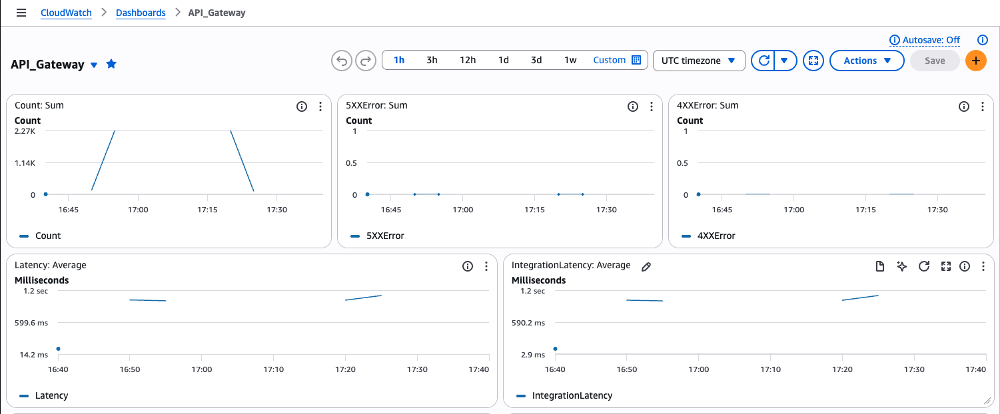
*API Gateway dashboard metrics.*

*DynamoDB dashboard metrics.*

*EKS dashboard metrics and workload status.*

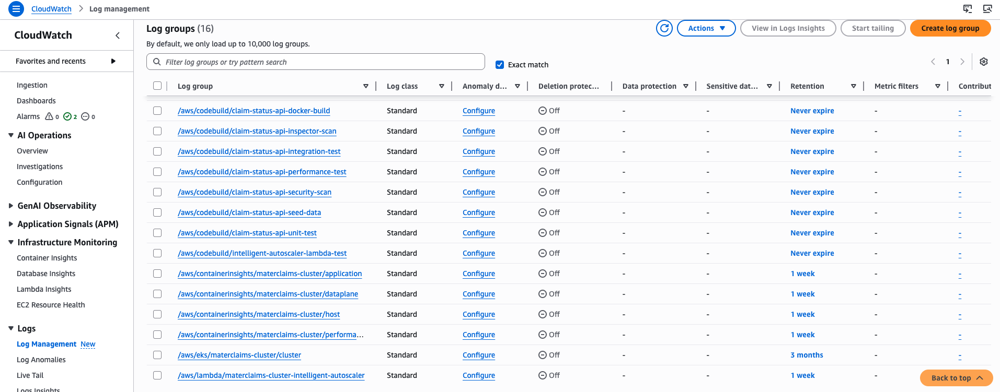
*Available CloudWatch log groups for diagnostics.*

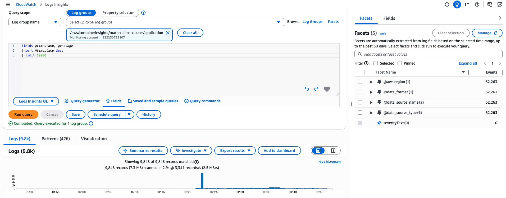
*Logs Insights query result sample #2.*

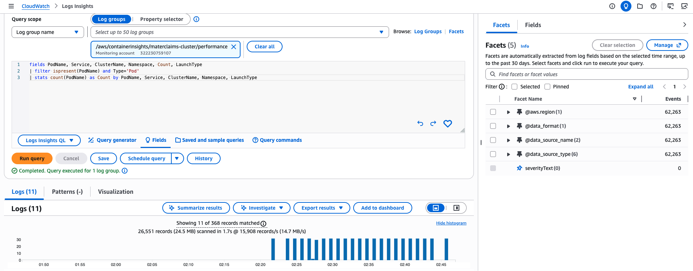
*Logs Insights query result sample #3.*

## CodeBuild Reports

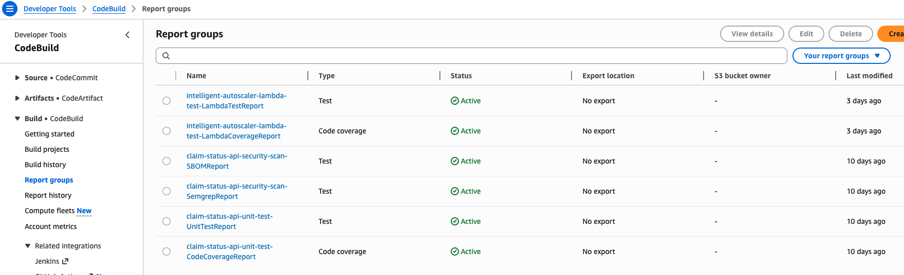
*CodeBuild reports overview for test/coverage outputs.*

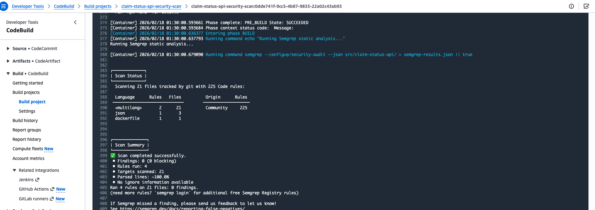
*CodeBuild security scan job result.*

*CodeBuild integration test job result.*

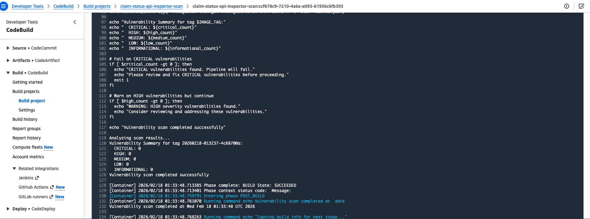
*CodeBuild Inspector scan execution evidence.*

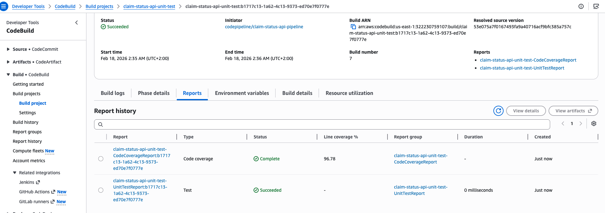
*Unit test report artifact in CodeBuild.*

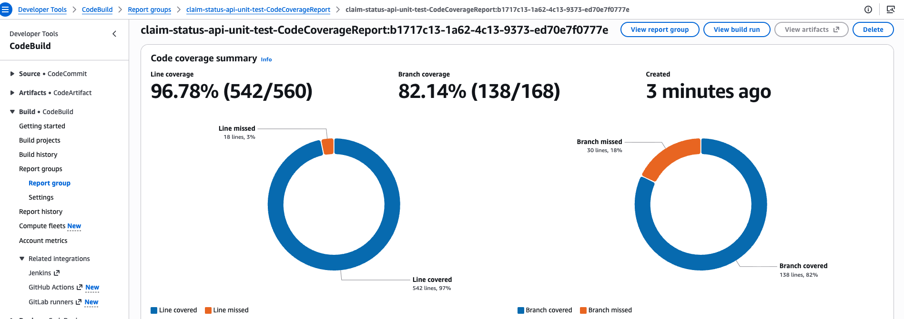
*Unit test coverage report artifact in CodeBuild.*

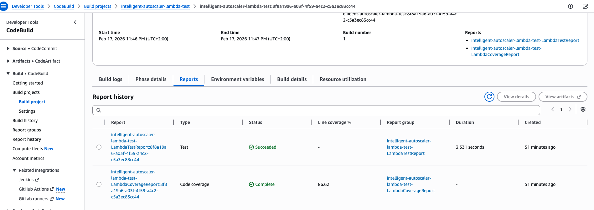
*Autoscaler Lambda test report output.*

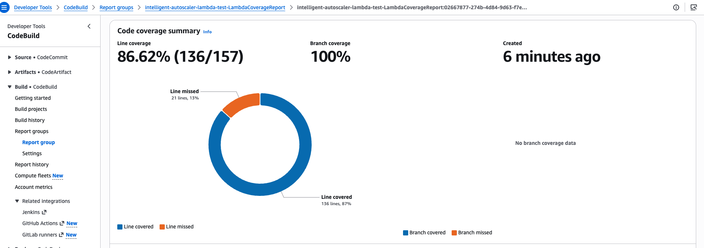
*Autoscaler Lambda coverage report output.*

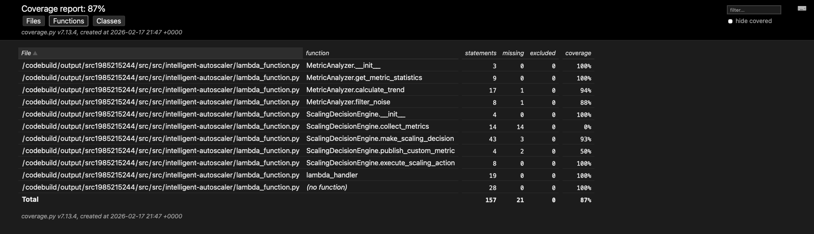
*Autoscaler code coverage evidence.*

## CodePipeline Runs

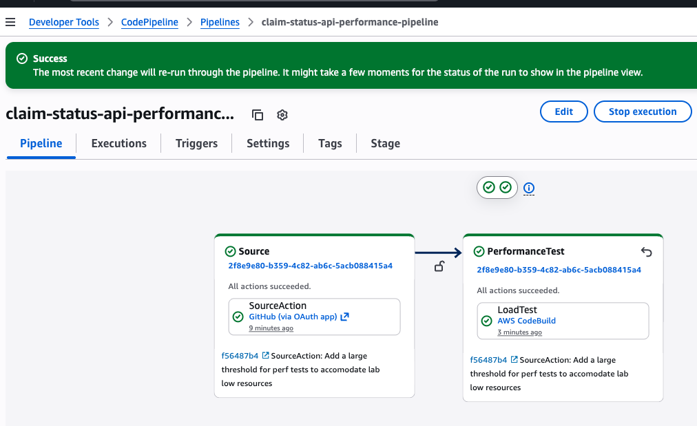
*Performance pipeline execution summary.*

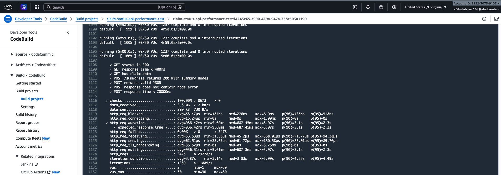
*Performance pipeline log evidence.*

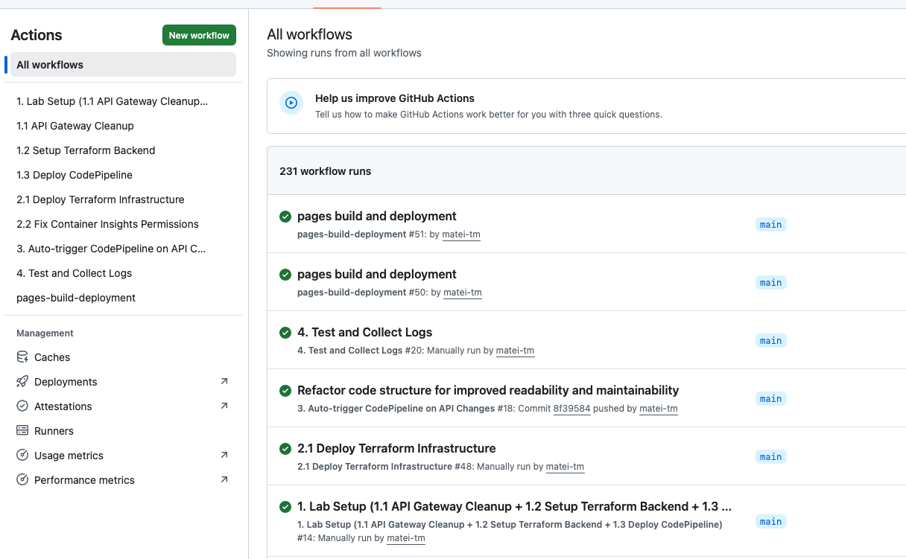
*GitHub Actions workflow summary view.*

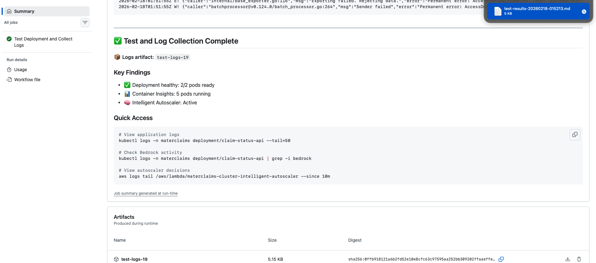
*Test deployment and log-collection workflow output.*

## Security and Compliance Evidence

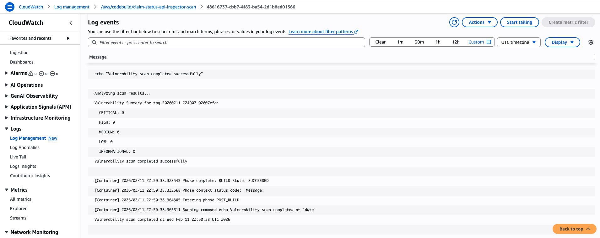
*Inspector vulnerability findings summary.*

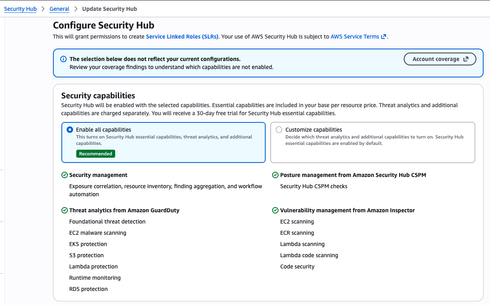
*Security Hub configuration/state snapshot.*

## Local Validation Evidence

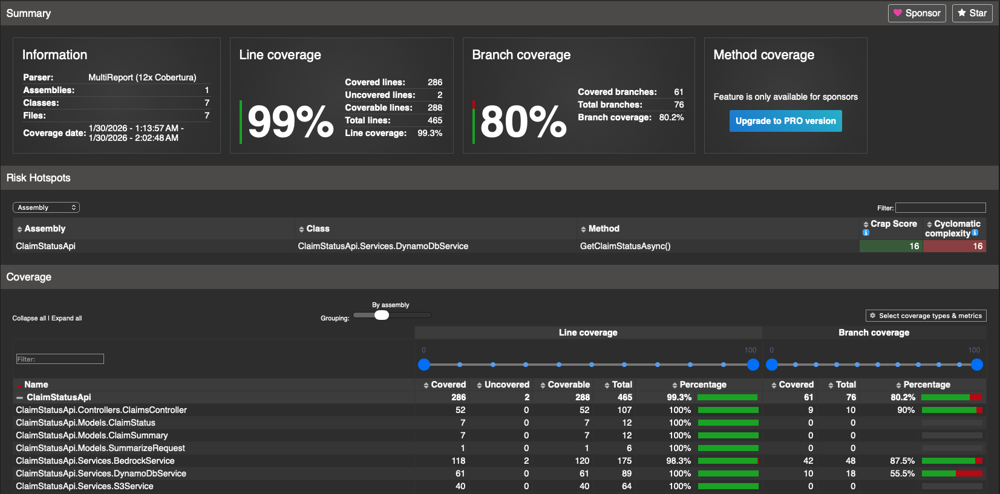
*Local code coverage execution evidence for claim-status-api.*
