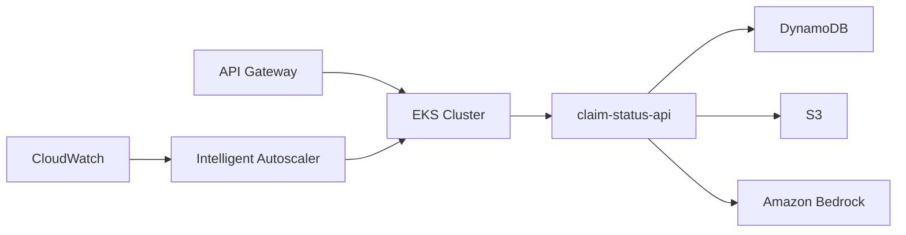

# Introspect2B: GenAI-Powered Claim Status API

A cloud-native microservice demonstrating enterprise-grade architecture patterns for GenAI integration on AWS. Built with .NET 10, Kubernetes, and Amazon Bedrock.

## 🚀 Quick Links

  <a href="getting-started" class="btn">Get Started</a>
  <a href="architecture/overview" class="btn">Architecture</a>
  <a href="deployment/deployment-guide" class="btn">Deploy</a>
  <a href="api-reference" class="btn">API Docs</a>

## 🎯 Overview

**Introspect2B** provides a production-ready example of integrating generative AI into insurance claim processing workflows. The API retrieves claim information from DynamoDB, fetches detailed notes from S3, and uses Amazon Bedrock (Claude 3 Haiku) to generate contextual summaries for different stakeholder perspectives.

### Key Features

✅ **RESTful API** — Two endpoints for claim retrieval and AI-powered summarization  
✅ **GenAI Integration** — Amazon Bedrock with Claude 3 Haiku for intelligent summaries  
✅ **Cloud-Native** — Kubernetes-first design with high availability  
✅ **Intelligent Autoscaling** — AI-workload-aware Lambda function for predictive scaling  
✅ **Security** — IRSA (IAM Roles for Service Accounts), least-privilege IAM  
✅ **Observability** — CloudWatch Logs Insights with 8 pre-built queries  
✅ **IaC** — Terraform and CloudFormation templates  
✅ **CI/CD** — AWS CodePipeline with security scanning  
✅ **Mock Data** — 8 realistic claim records with 4 detailed note blobs  

## 📊 Architecture Highlights

### Core Components

- **API Layer**: Regional API Gateway with AWS_IAM authentication
- **Compute**: Amazon EKS with 2-10 pod autoscaling
- **Data Storage**: DynamoDB for claims, S3 for detailed notes
- **AI/ML**: Amazon Bedrock (Claude 3 Haiku) for contextual summarization
- **Autoscaling**: Intelligent Lambda function with predictive scaling logic
- **Observability**: CloudWatch Logs, Metrics, and Container Insights

## 🎨 What Makes This Different?

### Intelligent Autoscaling System

Unlike traditional autoscaling that reacts to threshold breaches, Introspect2B includes an **intelligent autoscaling Lambda function** that:

- 📈 **Analyzes trends** using linear regression on CloudWatch metrics
- 🔍 **Filters noise** to distinguish real signals from temporary spikes
- 🎯 **Correlates signals** across CPU, memory, latency, and Bedrock metrics
- 🤖 **Makes explainable decisions** with full audit trail in CloudWatch Logs
- ⚡ **Proactive scaling** before performance degradation occurs

[Learn more about Intelligent Autoscaling →](features/intelligent-autoscaling)

### Production-Ready Observability

Pre-configured CloudWatch Logs Insights queries for:
- Service health diagnostics
- Bedrock invocation analysis
- Error pattern detection
- Performance profiling
- Cost optimization insights

[Explore Observability Features →](features/observability)

### Security-First Design

- **IRSA**: Fine-grained IAM permissions per Kubernetes service account
- **Secrets Management**: No hardcoded credentials
- **Network Isolation**: VPC with private subnets
- **API Security**: AWS_IAM authentication on API Gateway
- **Security Scanning**: CodeBuild integration with Inspector and Defender

[Review Security Architecture →](architecture/security)

## 📚 Documentation

### Getting Started
- [Quick Start Guide](getting-started) - Deploy in 30 minutes
- [Prerequisites](deployment/prerequisites) - AWS account setup
- [Local Development](development/local-setup) - Run locally

### Architecture
- [System Architecture](architecture/overview) - High-level design
- [Extended Architecture](architecture/extended) - Intelligent autoscaling deep dive
- [Security Model](architecture/security) - IAM roles and network design

### Features
- [GenAI Integration](features/genai-integration) - Amazon Bedrock implementation
- [Intelligent Autoscaling](features/intelligent-autoscaling) - Predictive scaling system
- [Observability](features/observability) - Monitoring and logging

### Deployment
- [Deployment Guide](deployment/deployment-guide) - Complete deployment walkthrough
- [GitHub Actions](deployment/github-actions) - CI/CD workflows
- [Terraform](deployment/terraform) - Infrastructure as Code

### Development
- [API Reference](api-reference) - Endpoint documentation
- [Testing Guide](development/testing) - Unit, integration, and performance tests
- [Contributing](development/contributing) - Development workflow

## 🛠️ Technology Stack

| Layer | Technology |
|-------|-----------|
| **API** | ASP.NET Core 10.0 (Minimal API) |
| **Container Orchestration** | Amazon EKS 1.31 |
| **AI/ML** | Amazon Bedrock (Claude 3 Haiku) |
| **Autoscaling** | AWS Lambda (Python 3.11) |
| **Data Storage** | DynamoDB, S3 |
| **API Gateway** | Amazon API Gateway (Regional) |
| **Infrastructure as Code** | Terraform 1.6.0 |
| **CI/CD** | AWS CodePipeline, CodeBuild |
| **Observability** | CloudWatch Logs Insights, Container Insights |
| **Security Scanning** | AWS Inspector, Microsoft Defender |

## 📈 Metrics & Monitoring

The system publishes custom CloudWatch metrics:

- `ScalingDecision`: Autoscaling recommendations (1=up, 0=none, -1=down)
- `ConfirmingSignals`: Number of correlated metric signals
- `TrendDirection`: CPU/Memory/Latency trend analysis
- Container Insights: Pod-level CPU, memory, network metrics
- Application metrics: Bedrock invocations, API latency, error rates

[View Monitoring Dashboard →](features/observability#cloudwatch-dashboard)

## 🤝 Contributing

We welcome contributions! This project demonstrates best practices for:
- Cloud-native .NET applications
- GenAI integration patterns
- Kubernetes autoscaling strategies
- Infrastructure as Code with Terraform
- CI/CD automation with AWS services

See the [Contributing Guide](development/contributing) for details.

## 📄 License

This project is licensed under the MIT License - see the [LICENSE](https://github.com/matei-tm/introspect2B/blob/main/LICENSE) file for details.

## 🔗 Additional Resources

- [GitHub Repository](https://github.com/matei-tm/introspect2B)
- [Amazon Bedrock Documentation](https://docs.aws.amazon.com/bedrock/)
- [Amazon EKS Best Practices](https://aws.github.io/aws-eks-best-practices/)
- [CloudWatch Container Insights](https://docs.aws.amazon.com/AmazonCloudWatch/latest/monitoring/ContainerInsights.html)

---

**Ready to get started?** Follow the [Quick Start Guide](getting-started) to deploy Introspect2B in your AWS account.
